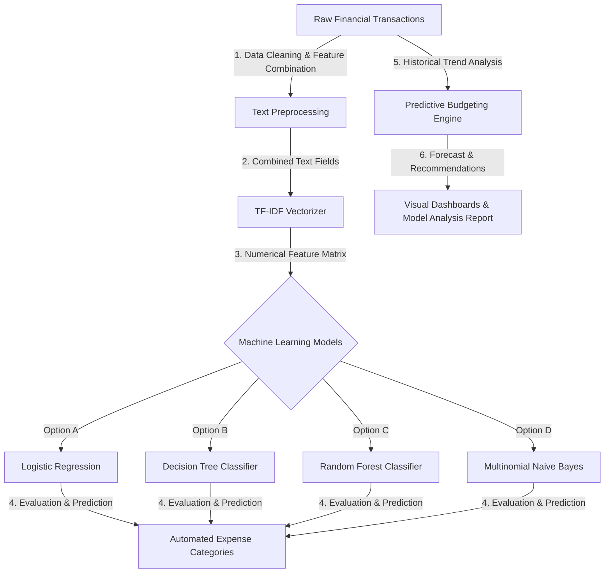

# AI-Powered Virtual Personal Finance Assistant

[](https://www.python.org/)
[](https://jupyter.org/)
[](https://scikit-learn.org/)
[](https://pandas.pydata.org/)
[](https://numpy.org/)
[](LICENSE)

An intelligent, data-driven **Virtual Personal Finance Assistant** designed to help users automatically categorize transactions, analyze historical spending patterns, generate predictive monthly budgets, and derive tailored savings recommendations using Machine Learning and Natural Language Processing (NLP).

---

## 🏗️ System Architecture & ML Workflow



---

## ✨ Key Features

- **🏷️ Automated Expense Categorization**: Uses NLP and TF-IDF feature extraction on transaction descriptions and merchant names to automatically classify expenses into categories (e.g., Groceries, Utilities, Entertainment, Travel).
- **📈 Predictive Budget Forecasting**: Analyzes historical spending velocity to generate accurate monthly budget estimates and issue proactive overspending warnings.
- **📊 Historical Spending Telemetry**: Interactive data visualizations detailing spending distribution, category breakdowns, and monthly trends.
- **💡 Smart Savings Recommendations**: Calculates personalized savings strategies and "what-if" financial projection scenarios based on user spending habits.
- **🔬 Comprehensive Model Benchmarking**: Comparative analysis of multiple classification algorithms (Logistic Regression, Decision Trees, Random Forest, Naive Bayes) evaluating accuracy, precision, recall, and F1-score.

---

## 🛠️ Technology Stack

| Layer | Technology |
| :--- | :--- |
| **Language** | Python 3.10+ |
| **Machine Learning** | Scikit-Learn |
| **Natural Language Processing** | TF-IDF Vectorization, NLTK / Regex Preprocessing |
| **Data Processing** | Pandas, NumPy |
| **Data Visualization** | Matplotlib, Seaborn |
| **Interactive Environment** | Jupyter Notebooks |
| **Documentation** | Microsoft Word (`Project_Report.docx`), Markdown |

---

## 📂 Project Structure

```text
.
├── docs/
│   └── Project_Report.docx           # Detailed Model Analysis Report & System Documentation
├── notebooks/
│   ├── Expense_classification.ipynb   # ML training, TF-IDF vectorization & model evaluation
│   ├── Budget_prediction.ipynb        # Predictive modeling for budget forecasting
│   └── Spending_analysis.ipynb        # Exploratory data analysis & spending visualizations
├── .gitignore                         # Git exclusion rules
└── README.md                          # Comprehensive project documentation
```

---

## 📊 Machine Learning Methodology

1. **Feature Engineering**:
   - Text concatenation of `Description` and `Merchant Name`.
   - Tokenization, stop-word elimination, and TF-IDF (Term Frequency-Inverse Document Frequency) vectorization to capture semantic context in financial descriptions.

2. **Classification Models Evaluated**:
   - **Logistic Regression**: Linear baseline with high interpretability.
   - **Decision Tree**: Non-linear decision rules for categorizing multi-class transactions.
   - **Random Forest**: Ensemble method providing robust classification accuracy and resistance to overfitting.
   - **Naive Bayes**: Probabilistic classification suited for high-dimensional text vectors.

3. **Predictive Budgeting**:
   - Time-series aggregation of historical monthly expenditures to model future budgetary limits per category.

---

## 🚀 Getting Started

### Prerequisites

Ensure Python 3.10+ and Jupyter Notebook are installed on your system.

### Installation

1. **Clone the repository:**
   ```bash
   git clone https://github.com/samaspoorthireddy/ai-finance-assistant.git
   cd ai-finance-assistant
   ```

2. **Install required dependencies:**
   ```bash
   pip install scikit-learn pandas numpy matplotlib seaborn jupyter
   ```

3. **Launch Jupyter Notebook:**
   ```bash
   jupyter notebook
   ```
   Navigate to the `notebooks/` directory and open:
   - `Expense_classification.ipynb` for model training and categorization benchmarks.
   - `Budget_prediction.ipynb` for predictive budgeting pipelines.
   - `Spending_analysis.ipynb` for spending trend analysis.

---

## 👤 Author

**Sama Spoorthi Reddy**  
- **GitHub:** [@samaspoorthireddy](https://github.com/samaspoorthireddy)  
- **Role Target:** Special Engineer Trainee (Software Development / Data Science & ML)

---

## 📜 License

This project is licensed under the MIT License - see the [LICENSE](LICENSE) file for details.
